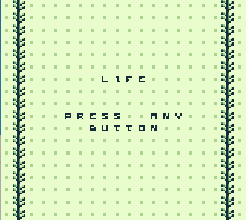

# LIFE_gb
 Conway's LIFE ported to the GameBoy original. 
 

 *****QUICKRUN INSTRUCTIONS***** 
 [1]: Download to your machine using Code -> Download ZIP 
 [2]: Download the BGB Emulator from https://bgb.bircd.org/ 
 [3]: Unzip LIFE_gb to your desktop (or other prefered location). 
 [4]: Right-click LIFE_gb/life.gb and select "open with" 
 [5]: Select bgb.exe as the tool to open with 
 
 *****CONTROLS***** 
 [ANY BUTTON]: Begin Automata 
 [SELECT]:     Quit Automata 
